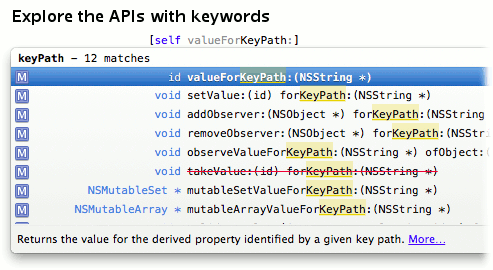

# Fuzzy Autocomplete for Xcode

## `LSLFuzzyAutocomplete 2.0` 
 
This is a Xcode 5 plugin that patches the autocomplete filter to work the same way the **Open Quickly** works. The fuzzy matching actually uses Xcode's own `IDEOpenQuicklyPattern`.

## Acknowledgement
`LSLFuzzyAutocomplete` is a fork of [chendo/FuzzyAutocompletePlugin](http://github.com/chendo/FuzzyAutocompletePlugin). For the differences between the versions and motivation behind forking see below.

## Features

#### Main Features

* Xcode's autocompletion matches like **Open Quickly** does
* Supports Xcode's learning and context-aware priority system
* [New] Completion List has visual feedback, highlights matched ranges
* [New] [Optional] Sort items by their score for easier searching
* [New] [Optional] Hide items with score lower than threshold for less clutter
* [New] [Optional] Inline Preview with matched ranges marked
* [New] [Optional] List Header showing the query and number of matches
* [New] [Optional] Show match scores for items in the List
* [Optional] Treat first few query letters as a prefix
* [New] A Settings Window for customizing plugin behaviour
* Productivity++
  
*[New] denotes a feature added in this fork*  
*[Optional] denotes a feature which can be configured in settings*

#### Other differences from chendo/FuzzyAutocompletePlugin

* `Tab` inserts an useful prefix based on whole fuzzy match
* The results should no longer depend on the speed of typing ...
* Previously hidden items can re-appear if their score rises
* Changes in settings do not require Xcode restart
* Got rid of order dependent "shortest match" selection mechanism
* Tweaked score formula with ability to tweak parameters
* Performance++
* UX++
* ...

## Compatibility
* Supports Xcode 5.1, 5.0
* Compatible with [KSImageNamed](https://github.com/ksuther/KSImageNamed-Xcode)
* Not compatible with the original FuzzyAutocomplete plugin (obviously)
  * When both plugins are detected option to remove either of them is shown to the user.

## Installation

* Either:
  * Install with [Alcatraz](http://alcatraz.io/) `LSLFuzzyAutocomplete`
  * Clone and build the project
* Restart Xcode and enjoy!

## Why a Fork?
I think the main reason might be subconscious envy that chendo had an awesome idea to use Apple's own code to improve Xcode so much. How cool is that? This idea should have been mine ;-).

But seriously, this project actually started as a set of small fixes and improvements which I intended to submit pull-requests for. But then I also started adjusting the plugin to my liking and realised that I have changed so many different things and that suddenly majority of the code is written by me. I used the plugin everyday so I wanted control over how the plugin works and looks. In the meantime chendo's version gained some more things I wanted done differently. Thus I ended up just having my own version.

After some thought I decided to release it. To be able to submit the plugin to Alcatraz, I needed to change the name, so I added the prefix LSL. I also decided to bump the version from 1.x to 2.0. This way my number is higher than theirs!